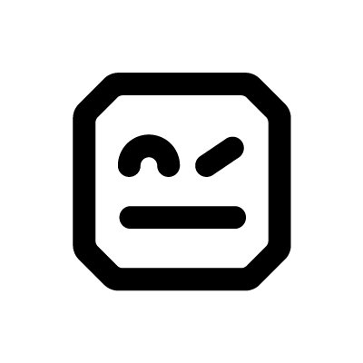

<table align="center"><tr><td align="center" width="9999">


# robotframework-docker

</td></tr></table>

Common project for building Robot Framework docker image.

## Container environment variables and build arguments
We can customize the build process of the docker container image through a set of environment variables:
* `ROBOT_WORK_DIR` : The workspace of the container, the directory that contains the tests and generated reports.
* `ROBOT_TEST_FRAMEWORK_DIR` : The test cases directory. This is where we mount the test framework whose testcases are executed from the container.
* `ROBOT_LOGS_DIR` : The directory where test reports are saved.
* `ROBOT_USER` : Container user.
* `ROBOT_GROUP` : Container user's primary group.
* `ROBOT_USER_UID` : User ID.
* `ROBOT_GROUP_ID` : Group ID.


## Running the container
The execution of the robot binary through the container is parameterized with the following environment variables:
* `ROBOT_OPTIONAL_PARAMETERS` : Optional robot parameters like e.g. --timestampoutputs --suitestatlevel
* `ROBOT_LOG_LEVEL` : Logging level like e.g. TRACE:DEBUG
* `ROBOT_LOGS_DIR` : The directory where test reports are saved.
* `ROBOT_VARIABLES` : A set of variables or variable files.
* `ROBOT_TESTS` : The test cases executed. This variable can be initialized with any combination of --test, --suite, --include etc robot arguments.
* `ROBOT_SUITES` : The directory containing test suites (.robot) files.

This container can be run using the following command:

```sh
docker container run --rm -it -v <path to testframework>:/opt/robotframework/testframework \
    -v <path to reports dir>:/opt/robotframework/logs \
    -e "PYTHONPATH=/opt/robotframework/testframework/libraries/" \
    -e "ROBOT_LOG_LEVEL=TRACE:DEBUG" \
    -e "ROBOT_VARIABLES=<robot variables>" \
    -e "ROBOT_TESTS=<robot test cases>" \
    -e "ROBOT_SUITES=<robot test suite>" \
    robotframework-docker:latest
```
